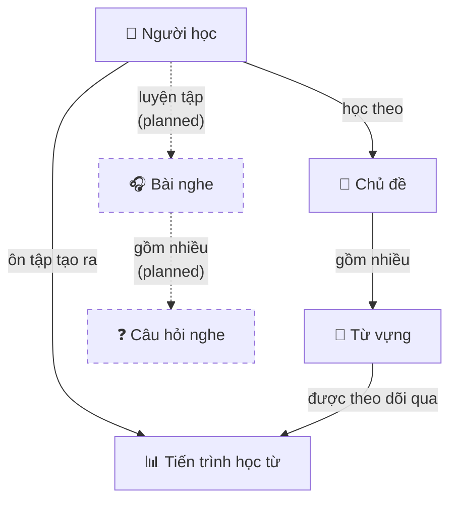

# Domain Model

Mô tả các khái niệm nghiệp vụ cốt lõi, mối quan hệ giữa chúng, và các quy tắc bất biến mà hệ thống phải luôn đảm bảo. Tài liệu này độc lập với công nghệ và cách lưu trữ dữ liệu.

---

## Bức tranh tổng thể



---

## Entities

### Người học (Learner)

Người sử dụng ứng dụng để học tiếng Anh. Là trung tâm gắn kết toàn bộ tiến trình học — mỗi người học có lộ trình hoàn toàn độc lập với người khác.

**Thuộc tính:**
- Địa chỉ email (định danh duy nhất để đăng nhập)
- Tên hiển thị
- Trình độ: Cơ bản / Trung cấp / Nâng cao

**Quy tắc nghiệp vụ:**
- Mỗi email chỉ tương ứng với một tài khoản.
- Trình độ ảnh hưởng đến nội dung được gợi ý, không giới hạn quyền truy cập — người học có thể tự do chọn chủ đề ở bất kỳ cấp độ nào.

---

### Chủ đề (Topic)

Tập hợp từ vựng cùng một lĩnh vực hoặc ngữ cảnh sử dụng (Thức ăn, Du lịch, Công việc…). Là đơn vị tổ chức nội dung lớn nhất trong từ vựng.

**Thuộc tính:**
- Tên tiếng Anh
- Tên tiếng Việt
- Mô tả ngắn
- Trình độ: Cơ bản / Trung cấp / Nâng cao

**Quy tắc nghiệp vụ:**
- Mỗi chủ đề thuộc đúng một trình độ.
- Một chủ đề phải có ít nhất một từ để có thể học được.

---

### Từ vựng (Word)

Đơn vị học tập cơ bản. Một từ tiếng Anh kèm đầy đủ thông tin cần thiết để người học Việt Nam hiểu và ghi nhớ.

**Thuộc tính:**
- Từ tiếng Anh
- Phiên âm IPA
- Từ loại (danh từ, động từ, tính từ…)
- Nghĩa tiếng Việt *(trường bắt buộc — là nội dung cốt lõi người học cần nắm)*
- Định nghĩa tiếng Anh
- Câu ví dụ tiếng Anh
- Dịch câu ví dụ sang tiếng Việt
- Audio phát âm
- Hình minh họa
- Trình độ: Cơ bản / Trung cấp / Nâng cao

**Quy tắc nghiệp vụ:**
- Mỗi từ thuộc đúng một chủ đề.
- Nghĩa tiếng Việt là bắt buộc — không thể có từ không có nghĩa.

---

### Tiến trình học từ (Learning Progress)

Ghi lại hành trình học của một người học với một từ cụ thể. Đây là nơi hệ thống lưu giữ trạng thái SRS để biết **khi nào** cần nhắc người đó ôn lại từ đó.

**Thuộc tính:**
- Hệ số ghi nhớ *(ease factor — phản ánh mức độ dễ/khó của từ đối với người này)*
- Khoảng cách ôn tập hiện tại (số ngày)
- Thời điểm cần ôn tiếp theo
- Số lần đã ôn
- Thời điểm ôn gần nhất

**Quy tắc nghiệp vụ:**
- Tiến trình học chỉ được tạo ra khi người học **chủ động ôn** từ đó lần đầu tiên — không tự động tạo khi gán vào chủ đề.
- Mỗi cặp (người học, từ) có đúng một bản ghi tiến trình.
- Hệ số ghi nhớ không bao giờ giảm xuống dưới ngưỡng tối thiểu (1.3) — đảm bảo dù quên nhiều đến đâu, khoảng cách ôn vẫn có thể tăng trở lại.
- Số lần ôn chỉ tăng, không giảm.

---

### Bài nghe (Listening Lesson) — Planned

Một bài luyện nghe hoàn chỉnh gồm audio gốc, transcript song ngữ và câu hỏi kiểm tra hiểu bài. Chưa triển khai trong MVP hiện tại.

---

### Câu hỏi bài nghe (Listening Question) — Planned

Câu hỏi gắn với một bài nghe cụ thể. Hỗ trợ ba dạng: điền từ, trắc nghiệm, đúng/sai.

---

## Value Objects

### Trình độ (Level)

Ba cấp độ học, áp dụng thống nhất cho Người học, Chủ đề, và Từ vựng:

| Giá trị | Ý nghĩa |
|---------|---------|
| Cơ bản (Beginner) | Từ và nội dung đơn giản, phù hợp người mới |
| Trung cấp (Intermediate) | Từ và nội dung ở mức trung bình |
| Nâng cao (Advanced) | Từ và nội dung phức tạp, học thuật hoặc chuyên ngành |

---

### Đánh giá ôn tập (Review Quality)

Mức độ người học tự đánh giá sau mỗi lần xem flashcard. Đây là tín hiệu đầu vào duy nhất để hệ thống điều chỉnh lịch ôn tập:

| Mức | Tên | Ý nghĩa |
|-----|-----|---------|
| 1 | Khó | Quên hoặc nhớ rất mờ — cần ôn lại sớm |
| 3 | Ổn | Nhớ được nhưng còn phải suy nghĩ |
| 5 | Dễ | Nhớ ngay lập tức, không cần suy nghĩ |

Chỉ nhận đúng ba giá trị này. Bất kỳ mức đánh giá nào khác đều không hợp lệ.

---

## Quan hệ giữa các khái niệm

```
Người học    1 ───── N    Tiến trình học từ
Từ vựng      1 ───── N    Tiến trình học từ
Chủ đề       1 ───── N    Từ vựng
```

- **Tiến trình học từ** là giao điểm giữa Người học và Từ vựng — một bản ghi tồn tại cho mỗi cặp (người học, từ) mà người đó đã học qua.
- **Từ vựng** thuộc về đúng một Chủ đề. Khi xóa một chủ đề, toàn bộ từ vựng và tiến trình liên quan cũng mất theo.
- **Tiến trình học từ** của một người học không ảnh hưởng đến người học khác dù họ học cùng từ.

---

## Domain Services

### SRS Scheduling (Lên lịch ôn tập)

Tính toán lịch ôn tiếp theo dựa trên trạng thái hiện tại và mức đánh giá vừa nhập.

**Đầu vào:** Tiến trình học hiện tại của từ + Đánh giá ôn tập (1 / 3 / 5)

**Đầu ra:** Hệ số ghi nhớ mới + Khoảng cách ôn mới + Thời điểm ôn tiếp theo

**Quy tắc tính:**
- Đánh giá **Khó (1)**: khoảng cách reset về 1 ngày, hệ số ghi nhớ giảm.
- Đánh giá **Ổn (3)** hoặc **Dễ (5)**: khoảng cách tăng dần (1 → 6 → nhân hệ số), hệ số ghi nhớ điều chỉnh theo mức đánh giá.
- Hệ số ghi nhớ không bao giờ giảm dưới 1.3.

Dịch vụ này **không có trạng thái** và **không phụ thuộc vào bất kỳ hệ thống lưu trữ nào** — chỉ nhận input và trả output thuần túy.

### Xác thực danh tính (Authentication)

Xác minh người học là ai và cấp quyền truy cập. Xử lý: tạo/kiểm tra mật khẩu, phát hành/thu hồi phiên đăng nhập.

Dịch vụ này **không có trạng thái** — không giữ thông tin phiên trong bộ nhớ.
